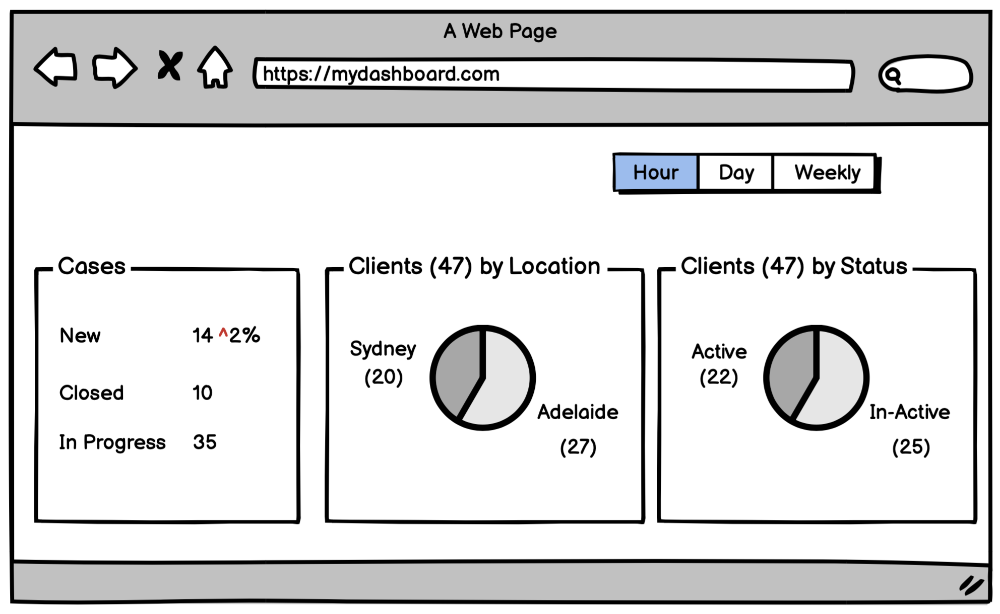

# Streaming Change Data Capture (CDC) with Debezium and Delta Lake

## Overview

Consider hypothetical ABC Lawyers, clients from various cities lodge one or more cases. The management would like to create an operational dashboard. Some business rules are as follows:
1. Case status is  New -> Accepted -> In Court -> Judgement Delivered -> Payment Received -> Closed
2. A Client with 1 or more cases which is NOT closed is considered Active, otherwise InActive
3. Client has 1 main australian city as location, but can update their location at any time.

Create a sample data pipeline to produce the following sample dashboard


This example pipeline captures [Debezium](https://debezium.io) CDC events and sink them into [Delta Lake](https://delta.io) tables.
Debezium streams _INSERT, UPDATE and DELETE_ on a database using Kafka Connect. Delta lake is a storage layer built on top of Apache Spark
## Architecture
    Postgres -> Debezium (KConnect) -> Kafka -> Spark Streaming -> Delta Table (Bronze) -> Spark Streaming -> Delta Silver

## Getting Started
### Pre-requisite
```
java
docker
scala
sbt
spark
```

### Quick Run

```bash
# Clone source code 
git clone git@github.com:chinkitp/delta.git
cd delta

# Terminal 1, Start the server
docker compose up

# Terminal 2, Run TPC-C Workload 
docker exec -it load bash
./hammerdbcli
dbset db pg;
buildschema
  
# Terminal 2, Upload KConnect configuration, compile code and spark-submi
curl -i -X POST -H "Accept:application/json" -H  "Content-Type:application/json" http://localhost:8083/connectors/ -d @./conf/debezium-cdc-postgres-source.json
sbt package
spark-submit --class au.com.aeonsoftware.TpccStreaming \
  --packages io.delta:delta-core_2.12:1.0.0,org.apache.spark:spark-sql-kafka-0-10_2.12:3.1.1 \
  --conf "spark.sql.extensions=io.delta.sql.DeltaSparkSessionExtension" \
  --conf "spark.sql.catalog.spark_catalog=org.apache.spark.sql.delta.catalog.DeltaCatalog" \
  ./target/scala-2.12/au-com-aeonsoftware-delta-sample_2.12-0.1.jar ./data/delta-store/ localhost:9092

# Terminal 3, Test with some data
spark-shell --packages io.delta:delta-core_2.12:1.0.0
var personDF = spark.read.format("delta").load("**FULL PATH**/delta/data/delta-store/bronze-person/")
personDF.show

# Terminal 4, insert update delete 
docker exec -it postgres bash -c 'psql -U postgres -d deltasample -f ./test-data.sql'

# Terminal 3. 
personDF.show

```

