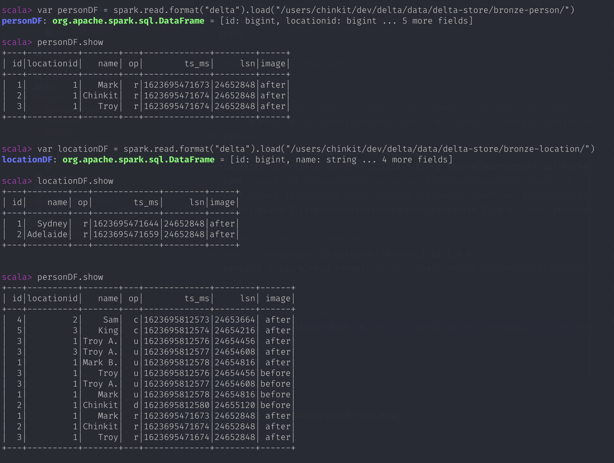

# Streaming Change Data Capture (CDC) with Debezium and Delta Lake

## Overview
Sample data pipeline to capture [Debezium](https://debezium.io) CDC events and sink them into [Delta Lake](https://delta.io) tables.
Debezium streams _INSERT, UPDATE and DELETE_ on a database using Kafka Connect. Delta lake is a storage layer built on top of Apache Spark
## Architecture
    Postgres -> Debezium (KConnect) -> Kafka -> Spark Streaming -> Delta Table (Bronze) -> Spark Streaming -> Delta Silver

## Getting Started
### Pre-requisite
```
java
docker
scala
sbt
spark
```

### Quick Run

```bash
# Clone source code 
git clone git@github.com:chinkitp/delta.git

# Terminal 1, Start the server
docker compose up

# Terminal 2, Upload KConnect configuration, compile code and spark-submi
curl -i -X POST -H "Accept:application/json" -H  "Content-Type:application/json" http://localhost:8083/connectors/ -d @./conf/debezium-cdc-postgres-source.json
sbt package
spark-submit --class au.com.aeonsoftware.App \
  --packages io.delta:delta-core_2.12:1.0.0,org.apache.spark:spark-sql-kafka-0-10_2.12:3.1.1 \
  --conf "spark.sql.extensions=io.delta.sql.DeltaSparkSessionExtension" \
  --conf "spark.sql.catalog.spark_catalog=org.apache.spark.sql.delta.catalog.DeltaCatalog" \
  ./target/scala-2.12/au-com-aeonsoftware-delta-sample_2.12-0.1.jar ./data/delta-store/ localhost:9092

# Terminal 3, Test with some data
spark-shell --packages io.delta:delta-core_2.12:1.0.0
var personDF = spark.read.format("delta").load("**FULL PATH**/delta/data/delta-store/bronze-person/")
personDF.show
```

